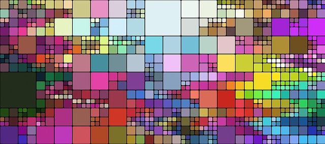

# Saturday, April 23, 2022


## Prerequisites
Before the workshop
* install [R](https://cran.r-project.org/)
* install [RStudio Desktop](https://www.rstudio.com/products/rstudio/download/) (open source edition)

Next, install the following packages
```
pkgs <- c("ggplot2", "dplyr", "mosaicData", "carData", "gapminder", "scales", "treemapify", "plotly", "leaflet", "ggridges")
install.packages(pkgs)
```

If you are new to **R**, you may want to read [A (Very) Short Introduction to R](https://cran.r-project.org/doc/contrib/Torfs+Brauer-Short-R-Intro.pdf).

## Under Construction (check back often)


